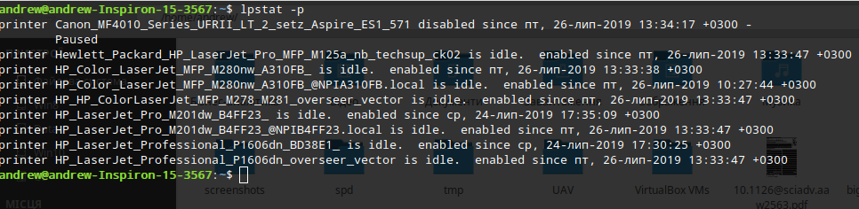
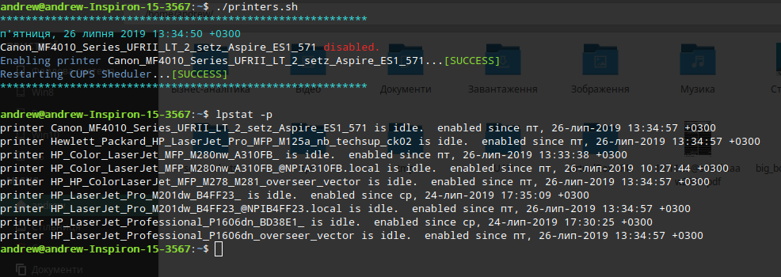

# cupsfix
My little fix for CUPS Scheduler. Sometimes network printers will be disabled or paused and cannot able to return to enabled state. Shell script search and enable this printers. If you will create CRON periodic task this operation will be automatic.
## How it works?
If printer or few printers disabled, script search disabled printers. 
For example the printer **Canon_MF4010_Series_UFRII_LT_2_setz_Aspire_ES1_571** disabled. 

For enabling printer run the script in terminal. For example,  ***./printers.sh*** if your script locates in current user directory. 
The screenshot below shows the result. Your result may be different.

**IMPORTANT** if you do not want to enter an administrator password for CUPS run the script from superuser (root).
